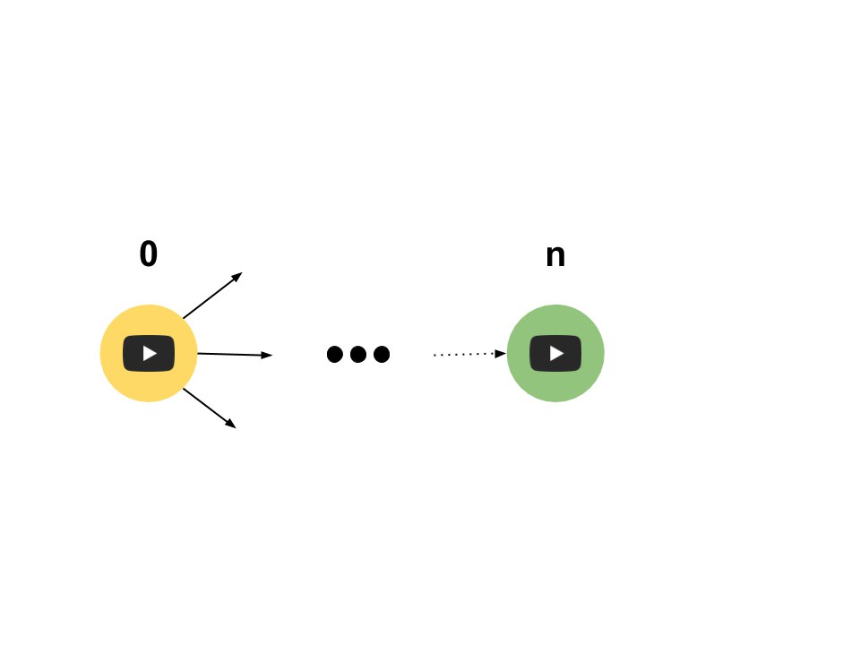
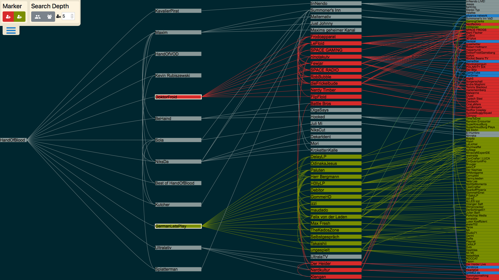

# YouTube Network Analyzer

Note:
Why?
 Self-interest in Youtube. Channels and Community.
 API accessible. Deriving data from it seemed fun.

---
## Idea

</img>

Note:
 - Channels can feature (up to 100) channels.
 - Featuring Reasons: Friendship, Support, Professional-Networks

+++

</img>

Note:
- Links can be visualized with graphs
- A link can be one sided or both sided
- we call this special case: "friendship"

- Bigger Picture: We can derive a huge graph from these links.
- But: too much clutter. Too big to handle. We want to visualize a special structure.

---

<h2 style="display:inline"> Concept/</h2><h2 style="color:grey;display:inline;">Abstraction</h2>
<table style="border:none; ">
  <tr>
    <td style="text-align:right;">
       linked 
    </td>
    <td>
      

        355
      

    </td>
  </tr>
  <tr>
    <td style="text-align:right;">
       double-linked 
    </td>
    <td>
      

        153
      

    </td>
  </tr>
</table>
<small>Example: YouTube Channel <a href="https://www.youtube.com/user/HandIOfIBlood">HandOfBlood</a> Depth 3</small>

Note:
- As example

- Using double-links as more meaningfull base data
- Explaining depth in next slide

+++

<h2 style="display:inline"> Concept/</h2><h2 style="color:grey;display:inline;">Layout</h2>

</img>

Note:
- Horizontal graph layout. Starting from one channel as seed. Graph becomes a tree.
- Depth in tree indicates relation: friend, friend of friend and so on

- Now we have a meaningful representation of these friendships. We can derive tasks.

---

<h2 style="display:inline"> Concept/</h2><h2 style="color:grey;display:inline;">Task</h2>

</img>

Note:
- Task: Disover new channels by exploring circle of friends based on a seed channel
- One question might arise: at which depth n? This question will be answered by using our implemented techniques.

+++
<h2 style="display:inline"> Concept/</h2><h2 style="color:grey;display:inline;">Techniques</h2>
+++
<h2 style="display:inline"> Concept/</h2><h2 style="color:grey;display:inline;">Demo</h2>

Note:
Explain Application UI
 - YouTube Channel as seed for data crawling
 - Marking of interesting YouTube Channels (Clustering -> Technical Challenges)
 - Depth threshold for graph search
 
Explain what we see
Seed channel
Friends, friends of friends ...
Hovering. Depends on specified depth
Depth specified in menu
Buttons: friend, friend of friend or value

Saving hover state as markers

Example Doctor Froid & BeHaind Depth: 2
Explain task result

Reset click

Example Doctor Froid & BeHaind Depth: 3
Explain task result

---

## Design Challenges

</img>

Note:
Y-Axes can be sorted. But how :(?
 - Problem: In- and Inter-Layer cluster arrangement
+++
## Design Challenges
- Seperation of data gathering and visualization
  - Server-Client layout
- Ground up implementation
  <ul style="list-style: none;">
    <li>🔍 Technical curiosity </li>
    <li>🐢 Slow data structure algorithms </li>
  </ul>
  
---

# 😧
# Questions?

Note:
If you are interested in in-depth topics, like implementation and overall usage. You can view our repository at this link.
