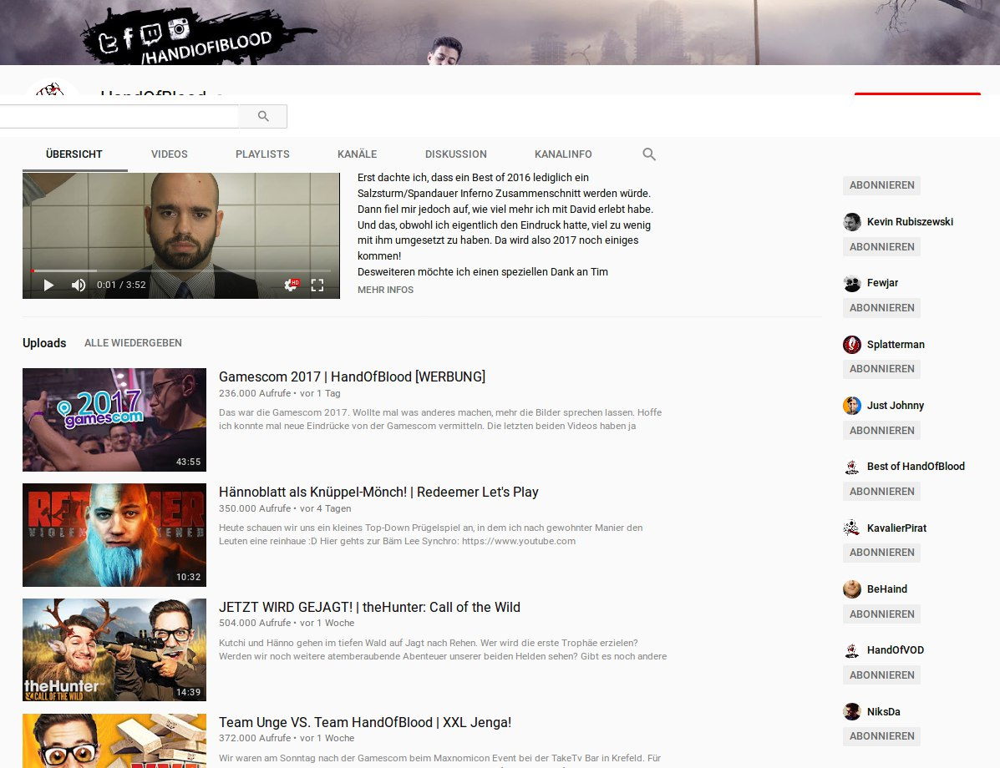
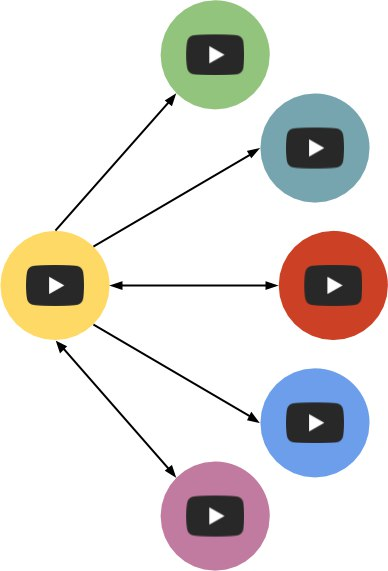
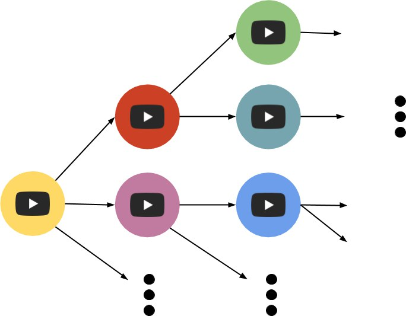

# YouTube Network Analyzer
---
## Idea

</img>

Note: lorem ipsum

+++

</img>

---

## Concept

<table>
  <tr class="fragment">
    <td>
      </img>
    </td>
    <td>
      

        <table style="border:none; ">
          <tr class="fragment">
            <td style="text-align:right;">
               linked 
            </td>
            <td>
              

                355
              

            </td>
          </tr>
          <tr class="fragment">
            <td style="text-align:right;">
               double-linked 
            </td>
            <td>
              

                153
              

            </td>
          </tr>
        </table>
        <small>Example: YouTube Channel <a href="https://www.youtube.com/user/HandIOfIBlood">HandOfBlood</a> Depth 3</small>
      

    </td>
  </tr>
</table>

+++

## Visualization Goals

- Discover new YouTube Channels based on user preferences
- User preferences:
  - YouTube Channel as seed for data crawling
  - Marking of interesting YouTube Channels (Clustering -> Technical Challenges)
  - Depth threshold for graph search

---

# Demo

---

## Design Challenges

- In- and Inter-Layer cluster arrangement
- Seperation of data gathering and visualization
  - Server-Client layout
- Ground up implementation
  <ul style="list-style: none;">
    <li>🔍 Technical curiosity </li>
    <li>🐢 Slow data structure algorithms </li>
  </ul>
