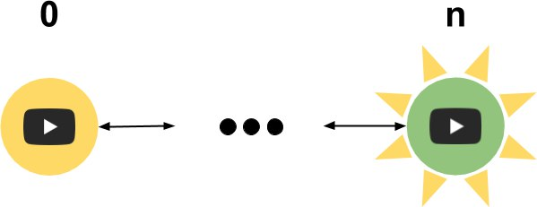

# YouTube Network Analyzer
---
## Idea

</img>

Note:
 - YouTube Channels 
 - YouTube Featured Channels (Meta Data)

+++

</img>

Note:
- Frindships can be visualized with graphs
- A friendship can be one sided or both sided

---

<h2 style="display:inline"> Concept/</h2><h2 style="color:grey;display:inline;">Layout</h2>

</img>

Note:
- Graph structure
- Horizontal graph layout 
+++

<h2 style="display:inline"> Concept/</h2><h2 style="color:grey;display:inline;">Abstraction</h2>
<table style="border:none; ">
  <tr>
    <td style="text-align:right;">
       linked 
    </td>
    <td>
      

        355
      

    </td>
  </tr>
  <tr>
    <td style="text-align:right;">
       double-linked 
    </td>
    <td>
      

        153
      

    </td>
  </tr>
</table>
<small>Example: YouTube Channel <a href="https://www.youtube.com/user/HandIOfIBlood">HandOfBlood</a> Depth 3</small>

Note:
Too many links
 - More meaningfull base data
   - Search for double links
   - Implicit shortest path between YouTube Channels
---

<h2 style="display:inline"> Goals/</h2><h2 style="color:grey;display:inline;">Task</h2>

</img>

Note:
- Discover new YouTube Channels based on user preferences
- User preferences:
 - YouTube Channel as seed for data crawling
 - Marking of interesting YouTube Channels (Clustering -> Technical Challenges)
 - Depth threshold for graph search

+++
<h2 style="display:inline"> Goals/</h2><h2 style="color:grey;display:inline;">Techniques</h2>
---

# Demo

---

## Design Challenges

- In- and Inter-Layer cluster arrangement
- Seperation of data gathering and visualization
  - Server-Client layout
- Ground up implementation
  <ul style="list-style: none;">
    <li>🔍 Technical curiosity </li>
    <li>🐢 Slow data structure algorithms </li>
  </ul>
