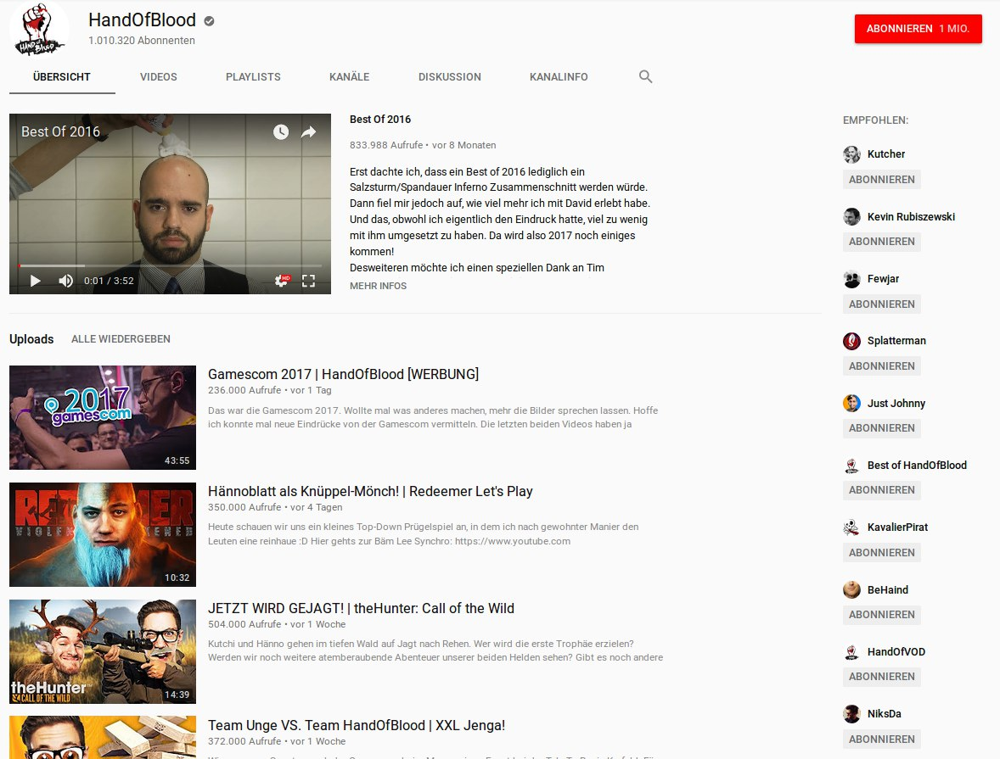

# YouTube Network Analyzer
---
## Idea

</img>

Note: lorem ipsum

+++

</img>

---

## Concept
</img>

+++

## Visualization Goals

- Discover new YouTube Channels based on user preferences
- User preferences:
  - YouTube Channel as seed for data crawling
  - Marking of interesting YouTube Channels (Clustering -> Technical Challenges)
  - Depth threshold for graph search

---

# Demo

---

## Design Challenges

- In- and Inter-Layer cluster arrangement
- Seperation of data gathering and visualization
  - Server-Client layout
- Ground up implementation
  <ul style="list-style: none;">
    <li>🔍 Technical curiosity </li>
    <li>🐢 Slow data structure algorithms </li>
  </ul>
